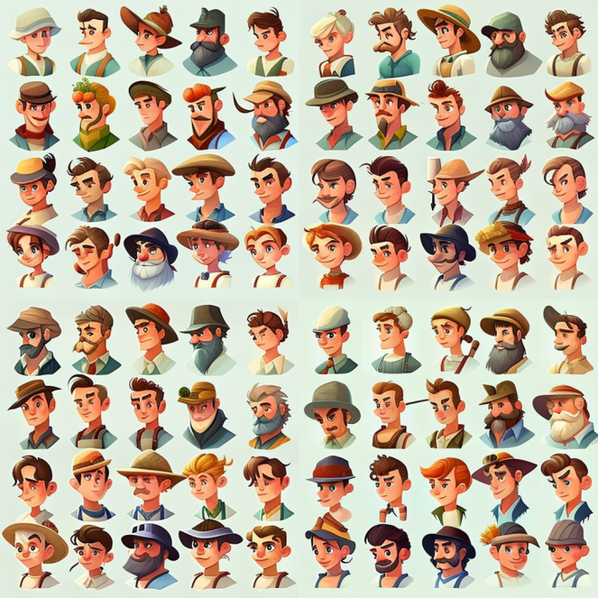
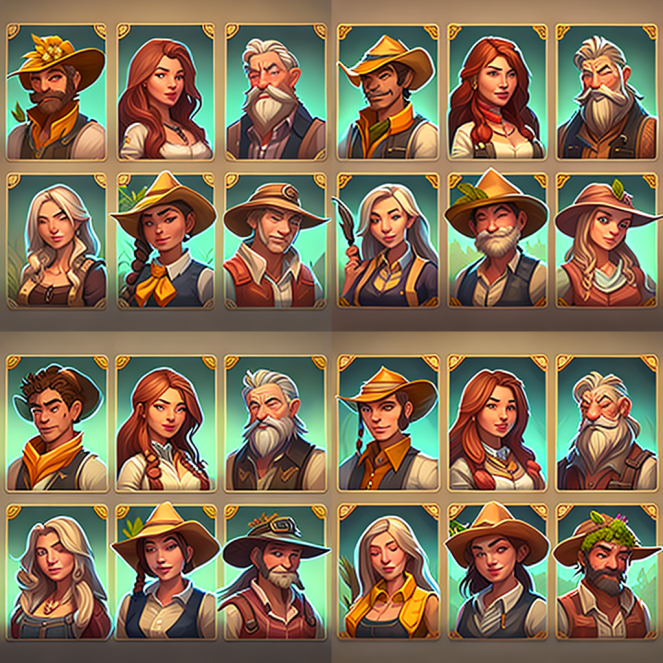
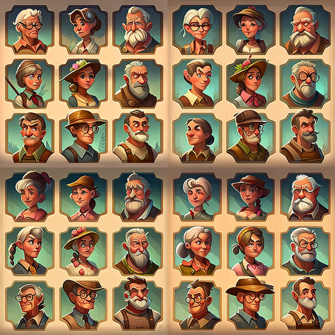
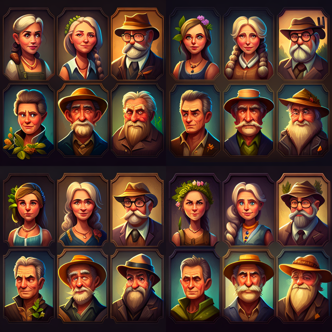

# 1. Select Avatar

Before you begin your development in the Metaverse, you will be prompted to choose your appearance that all other players will see.&#x20;

Every single avatar in the game is a special NFT, which brings additional benefits according to its level and item rarity.&#x20;

Players can have a certain number of avatars according to the number of islands they have. For each island, the player can choose a different avatar There are 3 types of avatars to choose from:&#x20;

1. Free avatar - NFTs of this type are unlimited and each new player can choose one of thousands of avatars or set their own appearance at will&#x20;
2. Premium Avatar - limited to 10,000 specially selected and rare NFTs. Players using such an avatar during gameplay will receive additional rewards from caring for their flowers.&#x20;
3. OG's avatar - limited to 1000 pieces, given to the first 1000 players who started the game and bought a premium avatar. By using these avatars in the game, the player gets special bonuses and weekly rewards.&#x20;
4. Special avatars - given to the team and players who helped develop the metaverse.

#### Free avatars:&#x20;

<figure><figcaption>
Free avatars
</figcaption></figure>

#### Premium avatars:&#x20;

<figure><figcaption></figcaption></figure>

#### OG's avatars:&#x20;

<figure><figcaption>
OG's avatars
</figcaption></figure>

#### Special avatars:&#x20;

<figure><figcaption></figcaption></figure>
