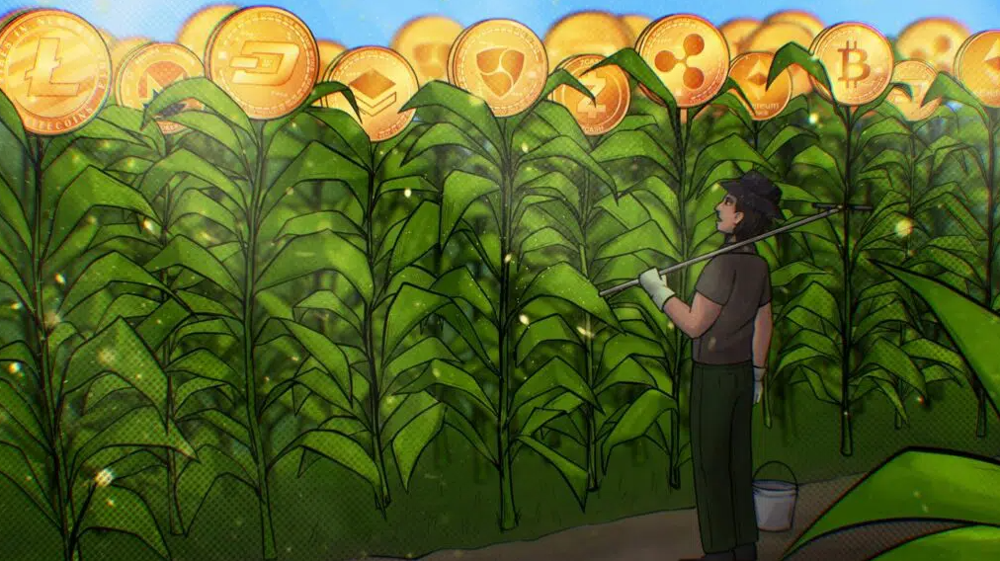

# 4. Earn cryptocurrency

### What is a farm game?

Farming games are time-based games in which, during a certain period, the user receives a reward for his interaction with the game.&#x20;

In "World of Flowers", players have the opportunity to receive crypto currency every 24 hours for each flower they grow.&#x20;

As soon as the game starts, the user gets an island and there he can "plant" his real flowers.&#x20;

To thank him for his care, the flowers will release coins that the user can collect and then use for donations, beautify their island or withdraw to their wallet.

<figure><figcaption></figcaption></figure>
