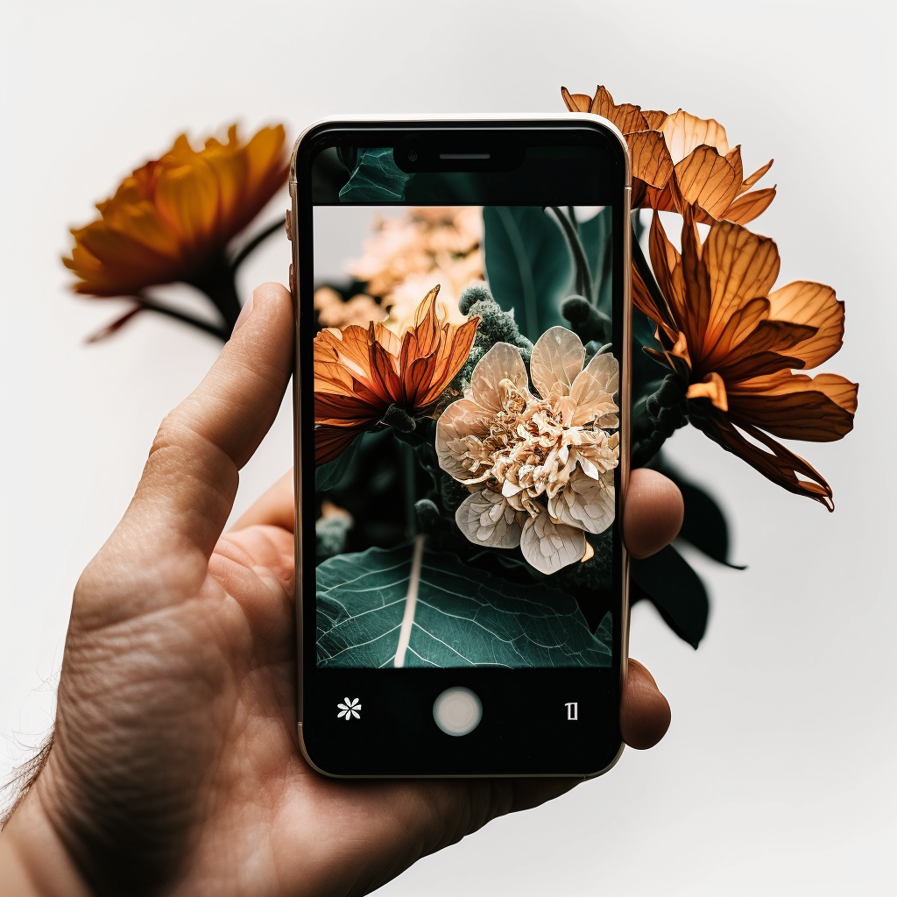

# 1. Take a picture of the flower

### The first step when working with the application is to add your first photo of a flower, plant or garden.

When the photo is uploaded, the app will provide you with several recognized faces based on the photo you uploaded.

Choose the type of flower that has the highest percentage and you think is correct or add a proper name if it is not recognized.&#x20;

In the next step, you can add additional information, such as the date of planting, the location of the flower and the date of the last watering.

<figure><figcaption></figcaption></figure>
