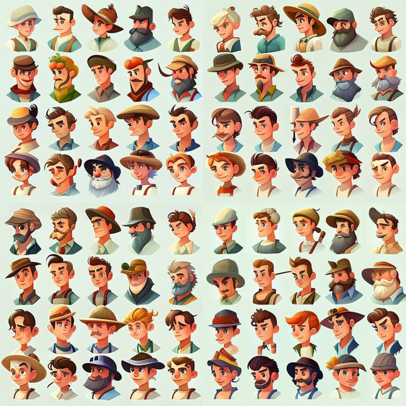
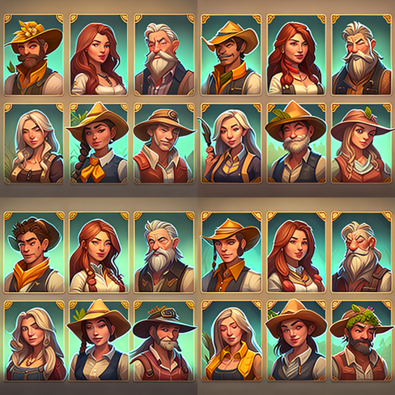
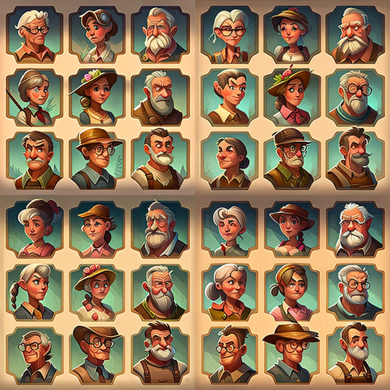
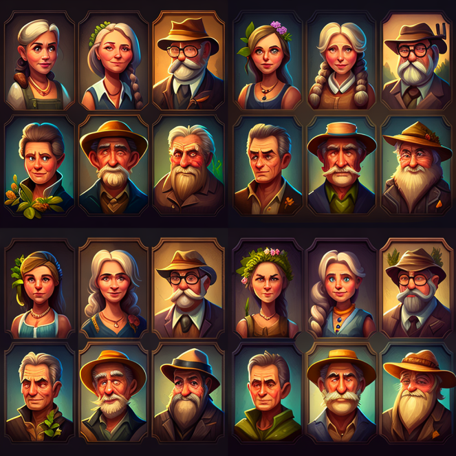

# 1. Избери Аватар

Преди да започнеш развитието си в Метавселената, ще бъдеш подканен да избереш външния си вид с който всички останали играчи ще виждат.

Всеки един аватар в играта е специално НФТ-и , което носи допълнителни ползи според нивото му и рядкостта на елементите.

Играчите могат да имат определен брой аватари според броя на островите с които разполагат. За всеки един остров, играчът може да избере различен аватар

Има 3 типа аватари от които може да избереш: &#x20;

1. Безплатен аватар - НФТ-итата от този тип са неограничен брой и всеки нов играч може да избере един от хилядите аватари или да настрой собствен вид по желание
2. Премиум аватар - ограничени до 10 000 броя специално избрани и редки НФТ-ита. Играчи използващи такъв аватар по време на игра ще получат допълнителни награди от грижата за цветята си.
3. OG's аватар - ограничени до 1000 броя, дават се на първите 1000 играчи започнали играта и купили премиум аватар. Използвайки тези аватари в играта, играча получава специални бонуси и седмични награди.
4. Специални аватари - дават се на екипа и на играчи помогнали за развитието на метавселената.

#### Безплатни аватари:&#x20;

<figure><figcaption>
Free avatars
</figcaption></figure>

#### Премиум аватари:&#x20;

<figure><figcaption>
Premium avatars
</figcaption></figure>

#### OG's аватари:

<figure><figcaption>
OG's avatars
</figcaption></figure>

#### Специални аватари:

<figure><figcaption>
Special avatars
</figcaption></figure>
