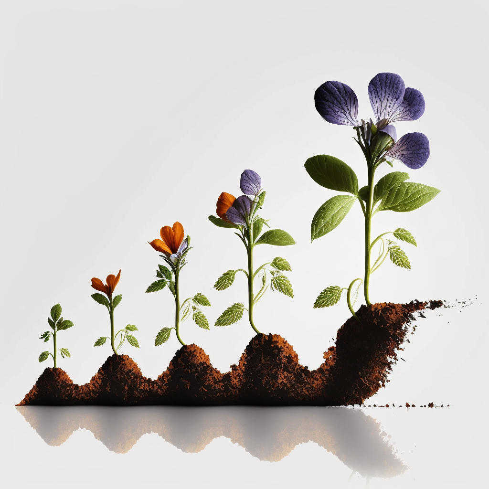

# Описание на нивата на цветя и градини 🧾

В началото, потребителя започва с качване на снимки на цветя.

С всяко поливане цветята му ще се развиват и нови снимки може да бъдат добавени.

Когато потребителя качи нова снимка на едно и също цвете, тя автоматично става като едно ниво нагоре и така друг потребител може да си купи целия цикъл на растеж на много рядко срещано в природата растение.

Същото правило важи при качване на допълнителни снимки на цели градини. Всяка следваща снимка, ще повишава нивото както на градината, така и на всички цветя които се съдържат в снимката.

<figure><figcaption></figcaption></figure>
